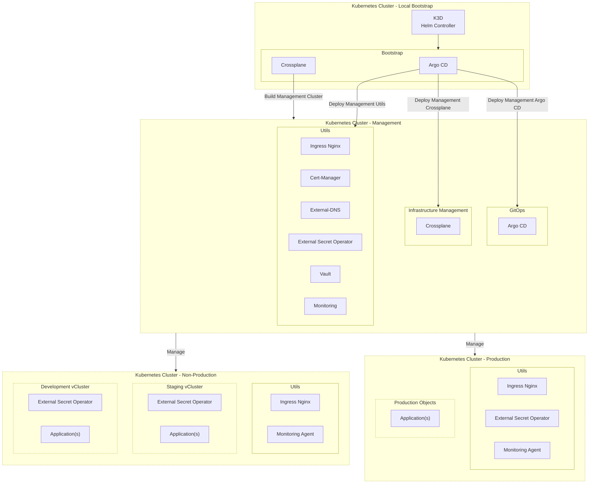

<p align="center">
  <a href="https://kubezero.io/" style="display: block; padding: 1em 0;">
    
  </a>
</p>

<h1 align="center">KubeZero</h1>
<p align="center"><b>Out-of-the-box Kubernetes IaC for Platform Engineering and Environment-as-Code</b></p>

> Kubernetes is the new Linux, Kubernetes is the platform!

KubeZero (also, `Kube0` and `K0`) is a production-ready Kubernetes platform IaC with GitOps designed for multi-environment Cloud Native setup and to keep Cloud costs under control. KubeZero is a set of patterns that can co-locate with other tools.

KubeZero is shipped with best-of-breed open-source industry-standard tools for multi-stage multi-cloud environments to make modern software development easier, faster, and more reliable. The main goal is to provide out-of-the-box Kubernetes for small and mid-size companies/teams with **zero** hassles.

This platform is inspired by [Kubefirst](https://github.com/kubefirst/kubefirst) but uses the Kubernetes ecosystem for EVERYTHING including infrastructure management (so no Terraform!).

## Why?

There are many solutions in the market that focus on big companies, but fewer solutions focus on small companies! **KubeZero's goal is to provide a simple and unified interface to manage environments (application and infrastructure) on Kubernetes for mid-size and small companies/teams.**

KubeZero is super helpful if you are using [Trunk-Based Development](https://trunkbaseddevelopment.com/) it will save a lot of effort and money (also it could be used with GitFlow as well).

## Architecture

KubeZero architecture is based on the following components:
- [K3d](https://github.com/k3d-io/k3d) for bootstrap (only run once using the same pattern of [Crossplane Bootstrapper](https://github.com/DevOpsHiveHQ/crossplane-bootstrapper) to initialize the setup).
- [ArgoCD](https://github.com/argoproj/argo-cd) for GitOps.
- [Crossplane](https://github.com/crossplane/crossplane) for infrastructure and cloud cluster management.
- [vCluster](https://github.com/loft-sh/vcluster) for virtual cluster management.



## Docs

- [KubeZero Packages](./packages/README.md)

## Patterns

KubeZero could be used to build applications and infrastructure in different patterns ... more details on the [setup patterns](./docs/patterns.md) page.
- **Single Cluster** - Main cluster with all environments in virtual clusters (all-in-one, isolation with cost saving)
- **Single Cluster** - Main cluster with production objects and non-production virtual clusters
- **Two Clusters** - Production cluster and  non-production cluster with virtual clusters
- **Three Clusters** - Management cluster, production cluster, and non-production cluster with multi-virtual clusters
- **Four Clusters** - Management cluster, production, staging, and development clusters

## Bootstrap

To bootstrap KubeZero, run K3d locally:

```shell
k3d cluster create --config bootstrap/k3d-bootstrap-cluster.yaml
```

It will start a local cluster with:

- Argo CD.
- Crossplane.
- KubeZero GitOps resources.

Once all resources are ready, Argo CD can be accessed via:

http://gitops.local.kubezero.io

## TODO

- Create the IaC for the management cluster.
- Create the IaC for the physical workloads cluster.
- Add a full working example.
