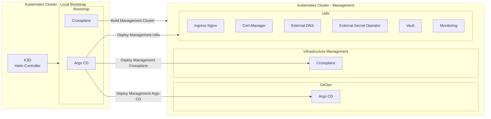
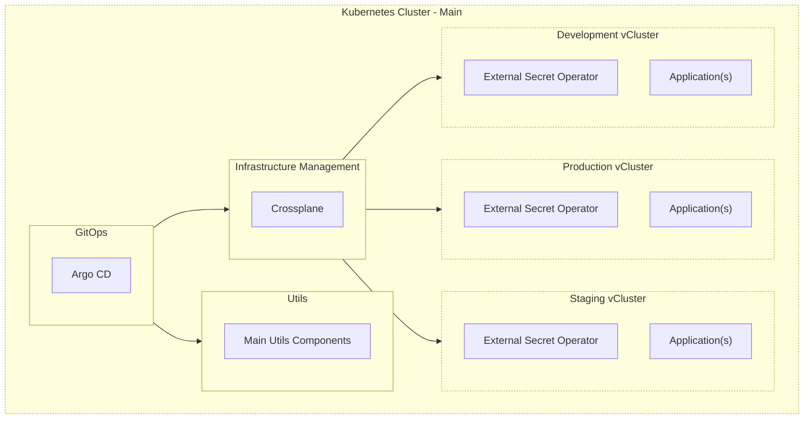
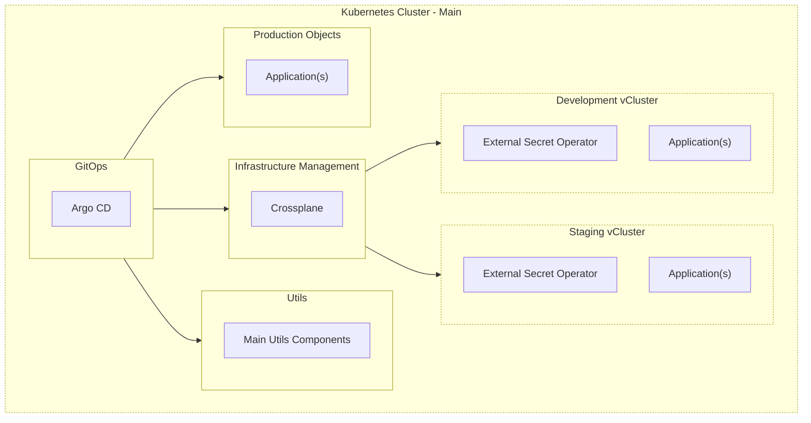
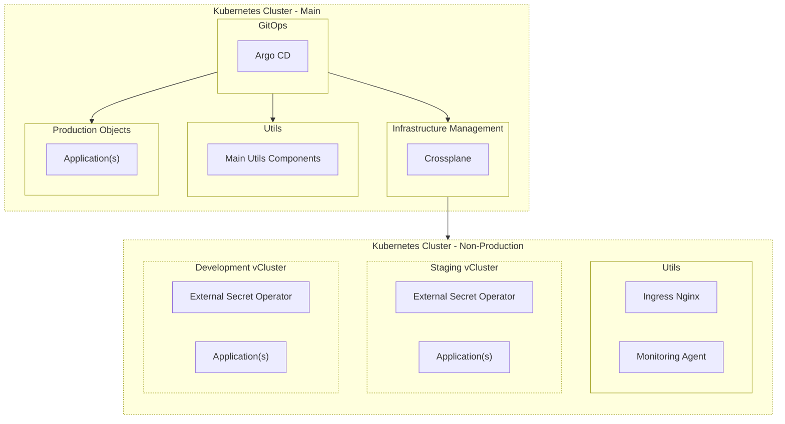
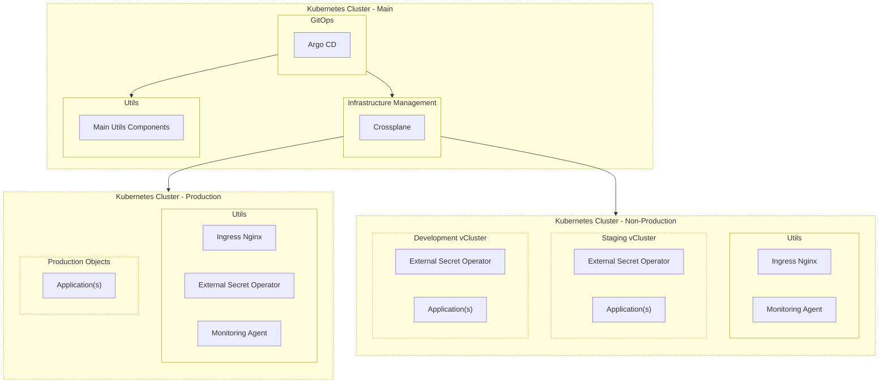
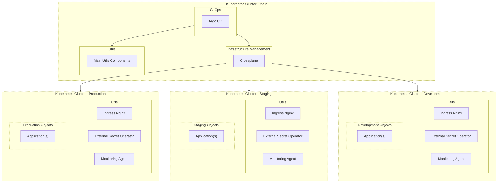

# Reference Architecture

## Bootstrap

## 01. Single Cluster - Main cluster with all environments in virtual clusters

## 02. Single Cluster - Main cluster with production objects and non-production virtual clusters

## 03. Two Clusters - Production cluster and  non-production cluster with virtual clusters

## 04. Three Clusters - Management cluster, production cluster and non-production cluster with multi-virtual clusters

## 05. Four Clusters - Management cluster, production, staging, and development clusters

